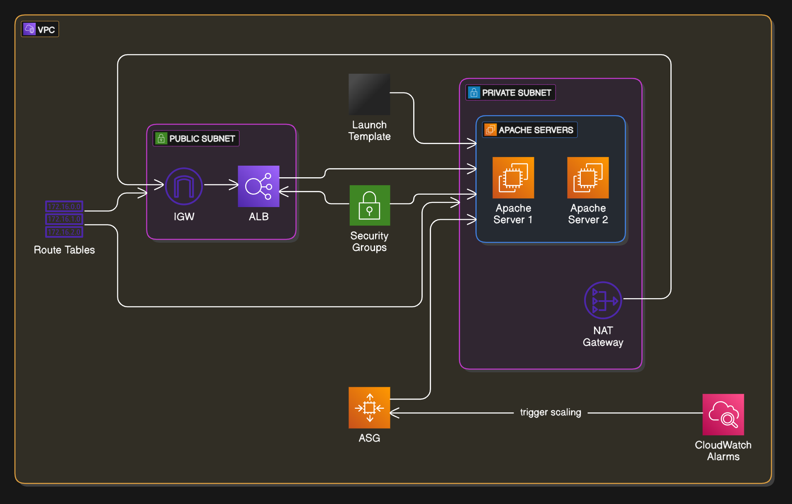

## Auto Scaling Lab

### Objective
Demonstrate automatic scaling using AWS CloudFormation to deploy an Apache web server that dynamically adjusts its capacity based on CPU load. When an instance exceeds a 50% CPU utilization threshold, the Auto Scaling Group (ASG) launches a new instance to distribute traffic. Each instance responds with its unique IP address and instance ID, verifying load distribution.

### Table of Contents
- [Prerequisites](#prerequisites)
- [Architecture Overview](#architecture-overview)
- [Setup Instructions](#setup-instructions)
- [Deployment Instructions](#deployment-instructions)
- [Testing the Setup](#testing-the-setup)
- [Deliverables](#deliverables)
- [Additional Notes](#additional-notes)

### Prerequisites
Before proceeding, ensure the following:
- An AWS account with necessary permissions to create EC2 instances, VPCs, subnets, Auto Scaling Groups, Load Balancers, and CloudFormation stacks.
- AWS CLI installed and configured with appropriate credentials.
- A GitHub account to host the CloudFormation template.


### Architecture Overview
The architecture consists of the following components:
- **VPC**: A Virtual Private Cloud (VPC) with public and private subnets.
- **Private Subnet**: Hosts the Auto Scaling Group (ASG) with Apache web servers.
- **Public Subnet**: Hosts the Application Load Balancer (ALB) to distribute traffic to the ASG instances.
- **Auto Scaling Group (ASG)**:
    - Minimum Capacity: 1 instance
    - Desired Capacity: 1 instance
    - Maximum Capacity: 3 instances
    - Scaling Policy: Scale out when CPU utilization exceeds 50%.
- **Apache Web Server**:
    - Displays a message: "Hello from \[IP Address\] / \[Instance ID\]".
    - Includes a button to artificially stress the CPU for testing scaling.
- **CloudFormation Template**: Automates the creation of all resources.

### Setup Instructions

### Step 1: Prepare the CloudFormation Template
Clone or download the repository containing the CloudFormation template.
```bash
git clone <https://github.com/AbuduSamadu/auto-scaling-lab.git>
cd <auto-scaling-lab>

```
Review the `autoscaling_lab.yaml` file to understand the resources being created.

### Step 2: Configure the Template Parameters
Update the parameters in the CloudFormation template as needed. The following parameters are available:
- **VPC CIDR**: Define the CIDR block for the VPC (e.g.,```10.0.0.0/16 ```).
- **Public Subnet CIDR**: Define the CIDR block for the public subnet (e.g.,```10.0.1.0/24 for public  ``` and  ```10.0.2.0/24 for private```).
- **KeyName**: Specify the name of your ec2 key pair for SSH access.

### Validate the CloudFormation Template
Validate the CloudFormation template locally using the AWS CLI:
```yaml
aws cloudformation validate-template --template-body file://template.yaml
```

### Deployment Instructions
#### Step 1: Create the CloudFormation Stack
- Use the AWS Management Console or AWS CLI to deploy the stack.
- Deploy the CloudFormation stack using the AWS CLI:
```yaml
aws cloudformation create-stack \
    --stack-name AutoScalingLab \
    --template-body file://template.yaml \
    --parameters ParameterKey=KeyName,ParameterValue=<your-key-pair-name> \
    --capabilities CAPABILITY_NAMED_IAM
   ```
- Monitor the stack creation progress in the AWS Management Console or using the AWS CLI.
```yaml
aws cloudformation describe-stacks --stack-name AutoScalingLab
```
#### Step 2: Verify Deployment
Once the stack creation is complete, verify the following:

- The VPC, subnets, and security groups are created.
- The Auto Scaling Group is running with 1 instance.
- The Application Load Balancer is deployed in the public subnet.

### Testing the Setup
#### Step 1: Access the Load Balancer URL
- Obtain the DNS name of the Application Load Balancer from the AWS Management Console.
- Open a browser and navigate to the ALB URL:
```http://<ALB-DNS-Name>```
- You should see the Apache web server page displaying the message: "Hello from \[IP Address\] / \[Instance ID\]".


### Step 2: Test Scaling Policy
- Click the "Stress CPU" button on the webpage to artificially increase the CPU load on the instance.
- Monitor the CloudWatch metrics for CPU utilization.
- Once the CPU utilization exceeds 50%, the ASG will trigger a scale-out event, launching a new instance.
- Refresh the browser to verify that traffic is distributed across multiple instances.


### Deliverables
1. GitHub Repository Link
   Provide the link to the GitHub repository containing the CloudFormation template:
```yaml
https://github.com/<your-username>/<repository-name>
```
2. ALB URL
   Provide the URL of the Application Load Balancer for testing:
```yaml 
http://<ALB-DNS-Name>
```